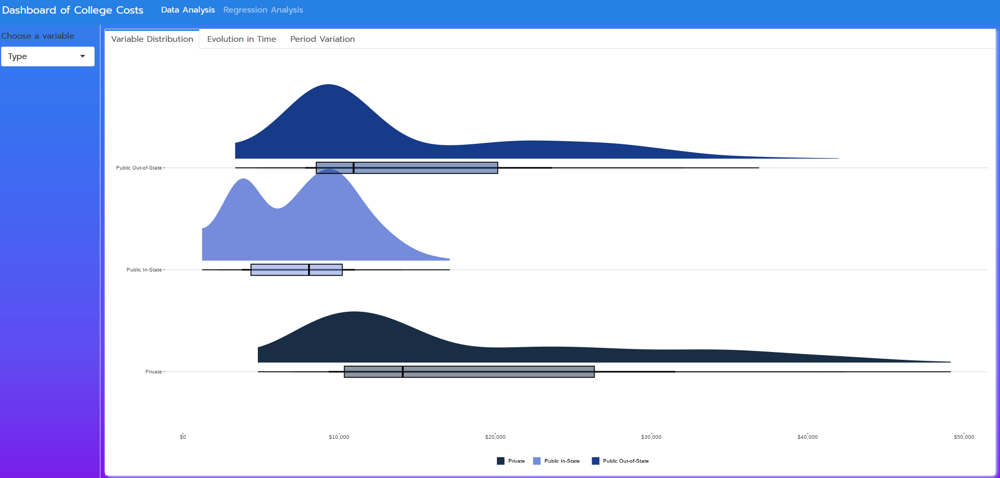

<!-- README.md is generated from README.Rmd. Please edit that file -->

## Project NCEES

The idea of the project is to analyze and understand how the variables
on the data set drive the cost change in USA colleges through EDA and
Quantile Regression.

## Data Dictionary

- Year: year considered.  
- State: U.S State.  
- Type: type of University, Private or Public and in-state or
  out-of-state. Private colleges charge the same for in/out of state.  
- Length: whether the college mainly offers 2-year (Associates) or
  4-year (Bachelors) program.  
- Expense: the cost being described.  
- Cost: cost in USD (\$).

## Exploratory Data Analysis

Regarding the distributions, we can see that:  
- Private colleges have a higher median cost and a longer tail while
public in-state have the lowest median and a bimodal distribution.  
- As expected, college that offer mainly 4-year (Bachelor) programs have
higher costs than 2-year (Associates) programs.  
- The room/board expenses are much more concentrated in 10,000 to 20,000
dollars, while fees/tuition costs are much more spread (higher standard
deviation) but with a lower median than the former.

<figure>

<figcaption aria-hidden="true">Exploratory Data Analysis</figcaption>
</figure>

## Quantile Regression Analysis

- There is a significant difference for all the coefficients in
  comparison to the linear regression.  
- For low cost colleges, the Room/Board expenses are pretty much equal
  to Fees/Tuition, while LR estimate it to be, in average, 10k cheaper.
  But, as the overall costs increase, the expenses with Room/Board tend
  to be lower than with Fees/Tuition.  
- 4-year programs are at least 5k more expensive than 2-year programs.
  But, for more expensive colleges, these programs tend to be way more
  expensive too, reaching 20k more.  
- Public in-state and out-of-state colleges are in fact less expensive
  than the private ones. The plot also shows that cheaper public
  out-of-state college don’t have too much difference in costs compared
  to the private colleges.

<figure>

<figcaption aria-hidden="true">Quantile Regression Plot</figcaption>
</figure>
